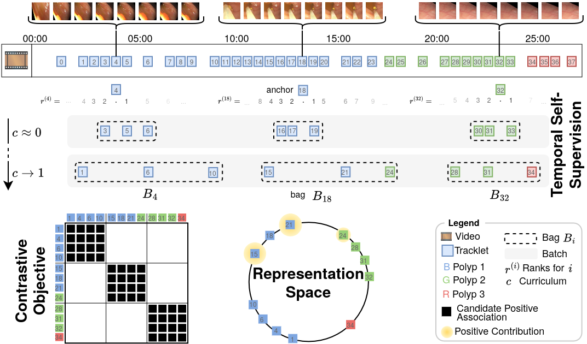

# Contrastive Learning under Noisy Temporal Self-Supervision for Colonoscopy Videos

[](https://arxiv.org/abs/2605.12320)

Luca Parolari¹, Pietro Gori², Lamberto Ballan¹, Carlo Biffi³*, Loic Le Folgoc²* 

¹ Department of Mathematics, University of Padova, Padova, Italy \
² Telecom Paris, Institut Polytechnique de Paris, Palaiseau, France \
³ Cosmo Intelligent Medical Devices, Dublin, Ireland \
\* Shared senior authorship.

Corresponding author: Luca Parolari \<luca.parolari@studenti.unipd.it\>

🌟 Early accpeted at MICCAI'26 main conference

# Abstract

> Learning robust representations of polyp tracklets is key to enabling multiple AI-assisted colonoscopy applications, from polyp characterization to automated reporting and retrieval. Supervised contrastive learning is an effective approach for learning such representations, but it typically relies on correct positive and negative definitions. Collecting these labels requires linking tracklets that depict the same underlying polyp entity throughout the video, which is costly and demands specialized clinical expertise. In this work, we leverage the sequential workflow of colonoscopy procedures to derive self-supervised associations from temporal structure. Since temporally derived associations are not guaranteed to be correct, we introduce a noise-aware contrastive loss to account for noisy associations. We demonstrate the effectiveness of the learned representations across multiple downstream tasks, including polyp retrieval and re-identification, size estimation, and histology classification. Our method outperforms prior self-supervised and supervised baselines, and matches or exceeds recent foundation models across all tasks, using a lightweight encoder trained on only 27 videos. Code is available at https://github.com/lparolari/ntssl.



# Table of Contents

- [Abstract](#abstract)
- [Structure](#structure)
- [Training](#training)
- [Downstream Tasks](#downstream-tasks)
  - [Retrieval](#retrieval)
  - [ReID](#reid)
  - [Size Estimation](#size-estimation)
  - [Histology Classification](#histology-classification)
- [Data](#data)
  - [Collections](#collections)
  - [Datasets](#datasets)
  - [Setup](#setup)
- [Pre-trained Checkpoints](#pre-trained-checkpoints)

# Structure

This repository provides the PyTorch reference implementation for the paper "Contrastive Learning under Noisy Temporal Self-Supervision for Colonoscopy Videos". 

The repository is structured as follows:

```bash
.
├── polypsense
│   ├── data        # <-- read the Data section below to setup
│   ├── dataset     # <-- tools to load datasets appropriately
│   ├── downstream  # <-- implementation for size and histology tasks
│   ├── e2e         # <-- main training code with models implementaion
│   └── reid        # <-- implementation for retrieval and reidentification tasks
└── README.md       # <-- this file
```

All requirements are listed in [requirements.txt](requirements.txt).

# Training

Use the following command to train the model:

```bash
python -m polypsense.e2e.cli \
  --dataset_root=data/rc27 \
  --num_workers=8 \
  --max_epochs=50 \
  --batch_size=60 \
  --fragment_length=8 \
  --fragment_stride=4 \
  --fragment_drop_last \
  --bbox_scale_factor=5 \
  --min_tracklet_length=30 \
  --im_size=232 \
  --aug_anchorcrop \
  --eval_n_views=2 \
  --eval_batch_size=6 \
  --eval_fragment_length=8 \
  --eval_aug_anchorcrop \
  --encoder_type=hmve \
  --sfe_backbone_arch=resnet50 \
  --sfe_backbone_weights=IMAGENET1K_V2 \
  --sfe_d_model=2048 \
  --d_proj=128 \
  --hmve_d_model=256 \
  --hmve_d_feedforward=1024 \
  --hmve_n_heads=8 \
  --hmve_n_layers=3 \
  --hmve_dropout=0.1 \
  --lr=0.00001 \
  --loss_type=mil-nce \
  --loss_temperature=0.07 \
  --loss_milnce_weights 1.0 1.0 \
  --sampler=temporaltemperaturebag \
  --sampler_ttb_tmin=0.3 \
  --sampler_ttb_tmax=12 \
  --n_views=5 \
  --exp_name=my_experiment
```

In the paper *K* is the bag size.
To simplify the implementation, here the bag size is expressed by the `--n_views` and its value must be set to *K+1* to account for the anchor tracklet.

# Downstream Tasks

## Retrieval

This task measures the ability to retrieve same-polyp tracklets.
Given a query tracklet, we rank all other tracklets by cosine similarity in the embedding space.
Performance is measured with mean Average Precision (mAP) and Hit Rate@K (HR@K).
Use the following command to execute retrieval task:

```bash
python -m polypsense.reid.cli \
  --task=retrieval \
  --dataset_root=data/rc19,
  --encoder_type=hmve \
  --encoder_ckpt=path/to/checkpoint.ckpt \
  --encoder_pooling=cls \
  --encoder_out_dim=256 \
  --data_fragment_length=-1 \
  --data_im_size=232 \
  --data_aug_anchorcrop \
  --data_aug_normalize \
  --data_bbox_scale_factor=5 \
  --exp_name my_retrieval_exp
```

## ReID

Re-identification measures the ability to decide whether two tracklets depict the same polyp entity or not. 
Using frozen embeddings, we compute the similarity between each embedding pair and threshold the scores to classify same-polyp vs different-polyp pairs.
Performance is measured with AUROC and AUPR.
Use the following command to execute re-identification task:

```bash
python -m polypsense.reid.cli \
  --task=reid \
  --dataset_root=data/rc19 \
  --encoder_type=hmve \
  --encoder_ckpt=path/to/checkpoint.ckpt \
  --encoder_pooling=cls \
  --encoder_out_dim=256 \
  --data_fragment_length=-1 \
  --data_im_size=232 \
  --data_aug_anchorcrop \
  --data_aug_normalize \
  --data_bbox_scale_factor=5 \
  --exp_name my_reid_exp
```

## Size Estimation

It is formulated as binary classification (diminutive, i.e. ≤5mm, vs non-diminutive) using non-linear probing. 
We freeze the encoder and train a classifier.
We report identity-weighted macro F1-Score.
Use the following command to execute size estimation task:

```bash
python -m polypsense.downstream.size.cli \
  --train_images=data/rsp/images \
  --train_annotations=data/rsp/annotations/instances_train.json \
  --val_images=data/rsp/images \
  --val_annotations=data/rsp/annotations/instances_val.json \
  --dataset_type=coco \
  --seed=42 \
  --max_epochs=20 \
  --opt_type=adamw \
  --opt_lr=0.0001 \
  --opt_weight_decay=0 \
  --lr_sched_type=onecycle \
  --batch_size=64 \
  --data_im_size=232 \
  --data_fragment_length=8 \
  --data_fragment_stride=4 \
  --data_fragment_drop_last \
  --data_aug_anchorcrop \
  --data_aug_normalize \
  --num_workers=8 \
  --n_classes=2 \
  --cls_type=mlp \
  --cls_init=default \
  --cls_hidden_dim=256 \
  --encoder_type=hmve \
  --encoder_pooling=cls \
  --encoder_out_dim=256 \
  --encoder_ckpt=path/to/checkpoint.ckpt \
  --exp_name=my_size_exp
```

## Histology Classification

It is treated as binary classification (adenoma vs non-adenoma) with the same non-linear probing setup.
Performance is measured with accuracy.
Use the following command to execute histology classification task:

```bash
python -m polypsense.downstream.size.cli \
  --train_images=data/rspp/images \
  --train_annotations=data/rspp/annotations/instances_train.json \
  --val_images=data/rspp/images \
  --val_annotations=data/rspp/annotations/instances_val.json \
  --seed=42 \
  --max_epochs=20 \
  --opt_type=adamw \
  --opt_lr=0.00001 \
  --opt_weight_decay=0 \
  --lr_sched_type=onecycle \
  --batch_size=64 \
  --data_im_size=232 \
  --data_fragment_length=8 \
  --data_fragment_stride=4 \
  --data_fragment_drop_last \
  --data_aug_anchorcrop \
  --data_aug_normalize \
  --num_workers=8 \
  --n_classes=2 \
  --class_mapping=ad_vs_hp \
  --cls_type=mlp \
  --cls_init=default \
  --cls_hidden_dim=256 \
  --encoder_type=hmve \
  --encoder_pooling=cls \
  --encoder_out_dim=256 \
  --encoder_ckpt=path/to/checkpoint.ckpt \
  --exp_name=my_size_exp
```

# Data

## Collections

We utilize four datasets in our experiments. 
The following table describe datasets' main properties.
We report the link to download the row dataset, including original videos or frames.

| Dataset | Frames | Videos | Polyps | Link |
| --- | --- | --- | --- | --- |
| REAL-Colon | 2757723 | 60 | 132 | [[download]](https://doi.org/10.25452/figshare.plus.22202866)
| SUN database | 152560 | 100 | 100 | [[download]](http://amed8k.sundatabase.org/) |
| PolypSize | 12888 | 42 | 42 | [[download]](https://doi.org/10.6084/m9.figshare.28030115)
| PolypsSet* | 37899 | 39 | 39 | [[download]](https://dataverse.harvard.edu/citation?persistentId=doi:10.7910/DVN/FCBUOR)

*The original PolypsSet dataset includes more than 39 videos, but many of them do not provide polyp identity annotations.

## Datasets

From this collection of datasets we derive the splits used for training the model or evaluating it on downstream tasks.
You can download the annotations and follow the instructions in [Setup](#setup) to prepare the data.

| Task | Dataset | Download |
| --- | --- | --- |
| Training | REAL-Colon (training set), aka `rc27` | [[annotations]](https://drive.google.com/drive/folders/1p2WBpf0e1R-luArUhn_ZGsP-j3KyLZr0?usp=sharing) |
| Retrieval & Re-identification | REAL-Colon (val+test set), aka `rc19` | [[annotations]](https://drive.google.com/drive/folders/1ig1b_6dpzzTkvf_wkB0Olox80bVCZjaZ?usp=sharing) |
| Size Estimation | RSP: REAL-Colon (val+test set) + SUN database + PolypSize, aka `rsp` | [[annotations]](https://drive.google.com/drive/folders/1MKdR97Xa9YK2MCZN_e1XGYDKM45NZGsd?usp=sharing) |
| Histology Classification | RSPP: REAL-Colon (val+test set) + SUN database + PolypSize + PolypsSet, aka `rspp` | [[annotations]](https://drive.google.com/drive/folders/15Z58lbkW3oXmWiGB77y4CCSLXwedWA7-?usp=sharing) |

Size estimation and histology classification requires a training set to train the classifier.
For this reason split RSP and RSPP datasets into training (70%) and validation (30%) set.
To avoid having tracklets from the same polyp both in training and validation set, we stratified split by polyp.

## Setup

All annotation files are structured in [COCO format](https://cocodataset.org/#format-data) with the following modifications:

```python
{
  "images": [
    {
      "id": int,
      "file_name": str,
      "width": int,
      "height": int,
      "frame_id": int,    # <-- position of a frame in the video
      "sequence_id": str, # <-- video label (e.g. 001-001)
      "dataset_id": str,  # <-- dataset label (e.g. dataset0)
    },
  ],
  "annotations": [
    {
      "id", int,
      "image_id", int,
      "bbox": list[int],
      "identity_id": str,  # <-- label of the polyp entity to which this annotation belongs to
      # optional extra metadata (histology, size)
    }
  ]
}
```

**Training**.You must download training annotations that include REAL-Colon providing 27 videos (85 polyps). 
Our dataloader requires the following folder structure:
```
rc27
|-- images  # <-- folder with all jpg files from REAL-Colon datasets
|   |-- 001-001_1.jpg
|   |-- 001_001_2.jpg
|       ...
|   `-- 004-015_54673.jpg
`-- annotations
    |-- instances_train.json  # <-- train annotations
    |-- instances_val.json    # <-- val annotations
    `-- instances_test.josn   # <-- test annotations
```

**Retrieval/Re-identification**. You must download retrieval/re-idetification annotations. 
Those include 19 unseen videos (47 polyps) from REAL-Colon.
Our dataloader requires the following folder structure:
```
rc19
|-- images  # <-- same as before
|   |-- 001-001_1.jpg
|   |-- 001_001_2.jpg
|   |   ...
|   `-- 004-015_54673.jpg
`-- annotations
    `-- instances_test.josn  # <-- different from previous one, this includes 19 unseen videos from REAL-Colon 
```

**Size Estimation**. Download size annotations and setup the following folder structure.

```
rsp
|-- images  # <-- folder with all jpg files from REAL-Colon, SUN database and PolypSize
|   |-- 001-001_1.jpg  # REAL-Colon images
|   |-- 001_001_2.jpg
|   |   ...
|   |-- case_M_20181001093706_0U62368100179605_1_004_002-1_a25_ayy_image0001.jpg  # SUN images
|   |   ...
|   |-- Video01_frame0000.jpg   # PolypSize images
|   |   ...
|   `-- Video42_frame0188.jpg
`-- annotations  # <-- split is 70/30, i.e. no test set
    |-- instances_train.json
    `-- instances_val.json
```

Note: 

**Histology Classification**. Download histology annotations and setup the following folder structure.

```
rspp
|-- images  # <-- folder with all jpg files from REAL-Colon, SUN database, PolypSize and PolypsSet
|   |-- 001-001_1.jpg  # REAL-Colon images
|   |-- 001_001_2.jpg
|   |   ...
|   |-- case_M_20181001093706_0U62368100179605_1_004_002-1_a25_ayy_image0001.jpg  # SUN images
|   |   ...
|   |-- Video01_frame0000.jpg   # PolypSize images
|   |   ...
|   |-- val_10_102.jpg
|   |   ...
|   `-- test_10_14.jpg
`-- annotations  # <-- split is 70/30, i.e. no test set
    |-- instances_train.json
    `-- instances_val.json
```

# Pre-trained Checkpoints

You can download and use our pre-trained model at this [link](https://drive.google.com/file/d/13Hif63XdPX1jsMuaW-NA-5gn_rqAZ9Oz/view?usp=sharing).